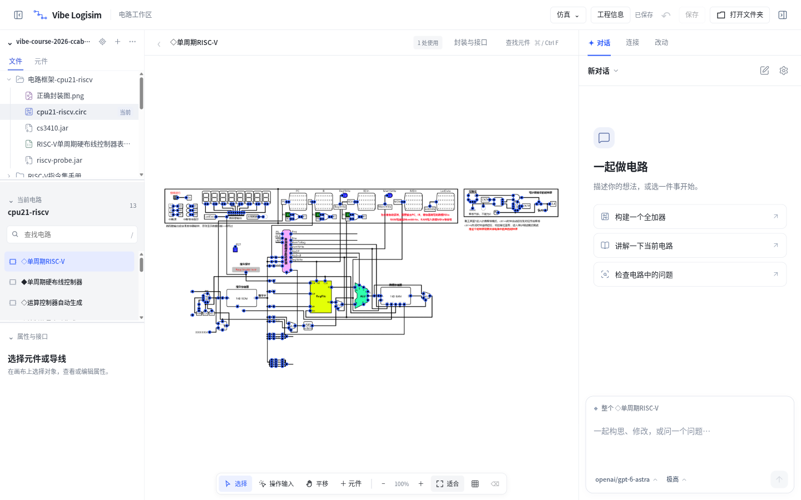

# Vibe Logisim

一个给组成原理 / 硬件综合训练课程用的电路工作台：在同一个窗口里画电路、跑仿真，并让 AI 读懂你的电路、帮你连线、找错、讲原理。兼容课程发布的 Logisim（HUST 2020 版和 Logisim-ITA 2.16），`.circ` 文件可以在两边随意来回打开。



## 下载安装

到 [Releases](https://github.com/FIY-pc/vibe-logisim/releases) 下载对应系统的压缩包，解压后直接运行，不需要安装 Java、Python 或任何依赖：

| 系统 | 文件 | 运行方式 |
| --- | --- | --- |
| Windows 10/11 x64 | `vibe-logisim-<版本>-win32-x64.zip` | 解压，双击 `vibe-logisim.exe`。首次运行如提示“未知发布者”，点“更多信息 → 仍要运行” |
| Linux x64 | `vibe-logisim-<版本>-linux-x64.tar.gz` | 解压，运行 `./vibe-logisim`（需要 GTK3 桌面和 systemd 用户会话） |

macOS 暂未提供安装包，欢迎有 Mac 的同学来帮忙验收。

## 五分钟上手

1. **打开文件夹**：把课程的电路、任务书、指令手册放在同一个文件夹里，点“打开文件夹”选中它。左栏是文件树，`.circ` 点开就在中间显示。
2. **画电路**：`A` 添加元件（搜索“与门”“寄存器”），点端口连线，`P` 进入操作输入模式后点输入引脚就能看信号；`Ctrl+T` 启停仿真，`Ctrl+Z` 撤销。
3. **连上 AI**（可选，不连也能正常画图和仿真）。右栏 AI 面板的提示卡上有两个按钮，或点右上角齿轮打开“AI 设置”，两个页签对应两种方式：
   - **ChatGPT 账号**：点“登录 ChatGPT”，浏览器里完成登录后自动回来连接。
   - **自定义接口**（中转站、DeepSeek、通义千问等给你的 API 密钥）：填接口地址（形如 `https://xxx/v1`）和密钥，模型列表会自动读出来供你选择（接口不提供列表时可以直接输入）。点“保存并连接”会先发一条测试请求：密钥错、地址错、模型名不存在、接口不支持 Responses API 都会当场用中文说明，确认可用才保存。密钥只保存在你自己的电脑上，以后改设置不用重新输入。
4. **让 AI 干活**：右栏输入框直接描述，比如“帮我在当前电路里加一个 8 位寄存器并接到 ALU 输出”“检查这个电路为什么 Cout 不对”“讲解一下这个子电路”。AI 会直接修改文件夹里的 `.circ`；每次改动都能在“改动”标签里查看、撤销。

空对话里有三个入口（构建全加器、讲解当前电路、检查问题），点一下就能试试效果。

## 关于 AI 接口

内置的 AI 引擎是 [OpenAI Codex](https://github.com/openai/codex) 的 app-server。自定义接口需要满足两点：

- 支持 **Responses API**（`POST /v1/responses`，流式）。国内主流中转站基本都支持；只提供 `chat/completions` 的接口目前用不了。
- **系统代理**：应用会读取系统代理（Clash、v2rayN 等开启「系统代理」后的设置，或 `HTTPS_PROXY` 环境变量），AI 引擎和保存前的检测都走同一条路；AI 设置右下角会显示当前检测到的代理。只支持 HTTP 代理（Clash 默认 7890 端口即可），纯 SOCKS 端口不行。改了代理设置后点「重新连接」生效。
- 模型要有基本的工具调用和写代码能力，越强的模型电路做得越好。课程作业级别的电路，GPT-5 系列、DeepSeek V3/R1、Qwen3 等都能用。

AI 只能读写你打开的那个文件夹（Windows 上由 Codex 的 workspace-write 沙箱限制，Linux 上由 systemd 隔离），不会碰电脑上的其他文件。

## 常见问题

- **打开课程电路提示缺少库**：`cs3410.jar`、`riscv-probe.jar` 等课程组件库要和 `.circ` 放在同一目录（保持课程压缩包原样解压即可）。
- **登录 ChatGPT 或连 OpenAI 一直失败**：先看 AI 设置右下角的网络一行。显示「直连」说明没检测到系统代理——在代理软件里开启「系统代理」（TUN 模式也可以），再点「重新检测」和「重新连接」。显示「代理不支持」是因为只开了 SOCKS 端口，改用 HTTP 或混合端口。
- **AI 面板显示“接口连接失败 / 连接已断开”**：点“检查 API 接口设置”重新保存一次，保存前的检测会直接告诉你是地址、密钥还是模型的问题（常见：地址少了 `/v1`；接口只支持 chat/completions）。ChatGPT 登录失效则点“登录 ChatGPT”重新登录。
- **Windows 杀毒软件拦截**：压缩包里带有 `logisim-ita-cn-20200118.exe`，这是课程发布的 Logisim 运行包，由内置 Java 当作 jar 加载，不会独立运行。
- **和课程 Logisim 的兼容性**：文件格式完全一致，可以随时用原版 Logisim 打开同一个文件核对。

## 从源码运行 / 参与开发

需要 Node.js 22+、Python 3.11+、JDK 17+，以及本机可用的 `codex` 命令。安装两个 Logisim 运行文件后：

```sh
npm --prefix apps/desktop ci
apps/desktop/run
```

构建安装包：

```sh
python3 scripts/distribution/build.py --target win32-x64 --output dist --course-runtime <logisim-ita-cn-20200118.exe>
```

详细说明见 [开发说明](docs/development.md)、[分发说明](docs/distribution.md) 和 [架构](docs/architecture.md)。

| 目录 | 职责 |
| --- | --- |
| `apps/desktop/electron/` | 桌面宿主、文件夹工作区、文件历史、AI 连接 |
| `apps/desktop/circuit-lens/web/` | 画布、文件树、属性、仿真和对话界面 |
| `apps/desktop/circuit-lens/studio/` | 电路文档、编辑、历史、仿真与协作服务（Python） |
| `apps/desktop/circuit-lens/native/` | 原生 Logisim 操作与渲染桥接（Java） |
| `scripts/distribution/` | 固定运行环境、校验下载、构建安装包 |

## 许可

本项目源码以 [GPL-3.0](LICENSE) 发布。原生桥接部分基于 GPL-3.0 的 Logisim-ITA 内部 API；安装包内附带的 CPython、Temurin JDK、Codex、PDF.js 保留各自许可证，见 [THIRD_PARTY.md](THIRD_PARTY.md)。课程发布的 Logisim 运行文件按课程原样附带，不作修改。
