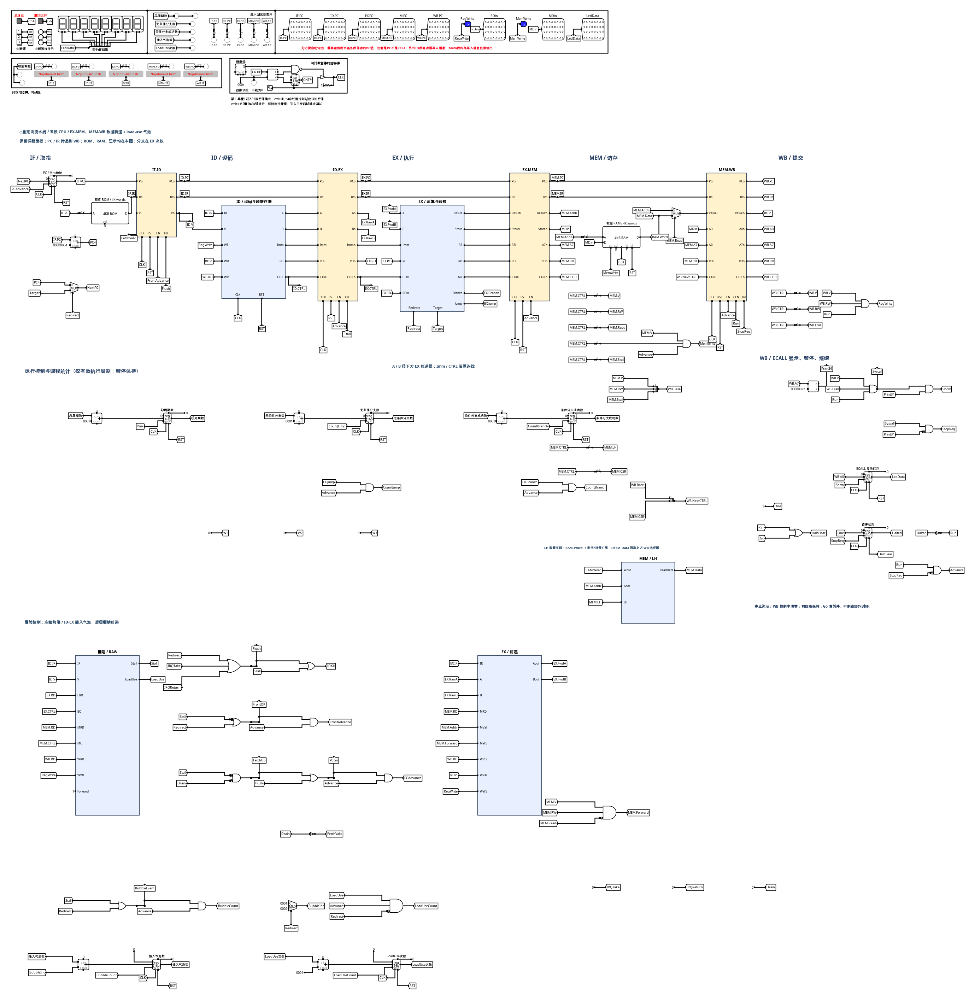

# Vibe Logisim

**把需求变成能运行、能读懂、能继续修改的数字电路。**

Vibe Logisim 是面向组成原理与硬件综合训练的桌面电路工作台。在一个窗口里打开课设、阅读资料、画图、仿真，也可以让内置 AI 实现电路、排查错误、整理图面，再根据你的反馈继续打磨。

使用真实的 Logisim 运行时，支持 HUST 2020 课程版与 Logisim-ITA 2.16。产物是可继续编辑的 `.circ` 电路，能用对应版本的课程 Logisim 打开核对。

[下载 Windows / Linux 版](https://github.com/FIY-pc/vibe-logisim/releases) · [0.4.0 更新说明](docs/releases/v0.4.0.md)

## 从一块逻辑到一套课设

- **从需求开始搭建。** 把任务书、初始电路和组件库放进文件夹，让 AI 完成组合逻辑、寄存器、数据通路，或接着已有课设继续做。人工编辑与 AI 修改使用同一份电路。
- **让复杂图面有阅读顺序。** 按功能分区、沿数据流安排阶段，把主要路径、控制支路和规则寄存器阵列组织起来。整理已有图时，可以明确保留课程面板、接口和指定结构。
- **像读代码一样追信号。** `Ctrl+点击` 隧道、端口或导线，查看驱动端、使用位置和总线位段映射；来源明确时直接跳转，`Alt+←` 回到上个位置。
- **边运行边找原因。** 用原生仿真观察信号、切换输入、推进时钟，把出错那一拍的预期与实际结果交给 AI，修完再验证。
- **用反馈继续改好。** 第一版之后可以继续指定阅读顺序、功能分区和需要调整的位置。无需学习布局工具参数，也可以随时自己接手修改。

[](docs/images/circuit-example.png)

## 下载与开始使用

到 [Releases](https://github.com/FIY-pc/vibe-logisim/releases) 下载完整压缩包并解压。包内带有运行环境，无需另装 Java、Python、Node.js 或 Codex。

| 系统 | 下载文件 | 启动方式 |
| --- | --- | --- |
| Windows 10/11 x64 | `vibe-logisim-<版本>-win32-x64.zip` | 双击 `vibe-logisim.exe`。未签名程序可能显示“未知发布者”提示 |
| Linux x64 | `vibe-logisim-<版本>-linux-x64.tar.gz` | 运行 `./vibe-logisim`；需要 GTK3 桌面，AI 功能需要 systemd 用户会话 |

macOS 暂未提供安装包。人工编辑和仿真不需要连接 AI；使用 AI 需要你自己的 ChatGPT 登录或 API 接口及相应额度。

1. **打开文件夹。** 放入 `.circ`、课程组件库、任务书和测试程序。左栏点开电路即可编辑，也能预览资料。课程压缩包建议保持原目录结构。
2. **连接 AI。** 打开右栏“AI 设置”，选择“登录 ChatGPT”，或在“自定义接口”填写地址、密钥和模型，点“保存并连接”。接口不提供模型列表时，可以直接输入模型名。
3. **交代任务。** 说明要完成什么、哪些结构必须保留、用什么结果验收。AI 会读写当前文件夹中的工程；在“改动”中查看、核对或撤销修改。
4. **运行、阅读、继续反馈。** 检查关键输入和输出，沿主路径读一遍图，把具体问题继续发给 AI。图面组织和功能验证都是交付的一部分，不必另补一句“记得整理”。

手工操作：`A` 添加元件，点端口连线，`P` 操作输入，`Ctrl+T` 启停仿真，`Ctrl+Z` 撤销。空对话也提供构建全加器、讲解电路、检查问题的快捷入口。

## 怎样把任务交给 AI

直接描述目标即可。下面的提示可以按实际文件名和要求替换：

**从课设框架开始**

> 按文件夹里的要求完成当前电路，保留模板的面板和对外接口。请验证关键功能，并把数据通路和控制逻辑组织到便于阅读的图面上，最后说明怎么运行和还没验证的部分。

**整理已有电路**

> 整理当前电路，保持功能和输入输出接口不变。将输入处理、计算和输出显示分区，让数据流从左到右展开，并保留已有注释。

**根据结果继续优化**

> 将输入选择模块放到运算模块左侧，输出显示放在右侧。对齐相关端口，让主要连线便于跟读，修改后复查原来的功能。

查错时，给出“哪个输入 / 程序、哪一拍、期望什么、实际什么”通常比只说“ERROR”更有帮助。任务要求之外若还有测试输入和预期输出，一起放进文件夹。

复杂课设建议选择推理、工具调用和图像理解能力较强的模型。完整课设往往需要反馈迭代，请把最终电路放到你的课程运行时和验收环境中核对。

## 信号多了，怎样读图

选中元件或导线可查看连接。`Ctrl+点击` 信号可以追踪实际连接，而不只是搜索同名标签：

- 找到当前子电路内的上游驱动端与使用位置，点击条目定位。
- 经过分线器时显示位段映射，例如字段信号对应总线的哪几位。
- 高亮相关连线和元件，`Alt+←` 或“返回上个位置”回到先前视图。
- 有多个来源、来源只覆盖部分位或方向未知时，列出候选供你查看。

这样既可以保留必要的跨模块隧道，也能查清一个信号究竟从哪里来。

## AI 连接与常见问题

自定义接口需要支持**流式 Responses API**（`POST /v1/responses`），仅提供 `chat/completions` 的接口不能直接使用。保存前会检测地址、密钥、模型和接口能力；密钥保存在本机。连接检测通过后，复杂任务仍取决于模型能力及提供商的工具、图像和上下文支持。

应用读取系统 HTTP 代理或 `HTTPS_PROXY`；AI 设置中可以查看检测结果。调整代理后点击“重新连接”。纯 SOCKS 地址不支持，可改用代理软件的 HTTP 或混合端口。

| 遇到的问题 | 可以怎么处理 |
| --- | --- |
| 课程电路提示缺少库 | 保持课程包中的相对路径，确认 `cs3410.jar`、`riscv-probe.jar` 等实际依赖齐全 |
| AI 接口连接失败 | 在 AI 设置中重新检测；检查 `/v1` 地址、模型名、Responses 支持和代理状态 |
| 长任务中途报错 | 先查看文件夹里已保存的电路和工作记录，再继续任务。需要新建对话时，保持使用同一文件夹，说明已完成内容和待办 |
| 要用原课程软件核对 | 使用对应的 Logisim 版本并保留组件库；不保证所有 Logisim 分支或第三方库互通 |
| Windows 拦截课程运行文件 | 包内 `logisim-ita-cn-20200118.exe` 是课程运行包，由内置 Java 当作 jar 加载，不会独立启动 |

## 反馈问题

点右上角“…”→“反馈问题…”，可以保存诊断包、复制摘要并打开 [GitHub Issues](https://github.com/FIY-pc/vibe-logisim/issues/new/choose)。AI 报错卡也有反馈入口。

诊断包包含版本、连接状态、日志和最近失败的电路工具调用；不包含 API 密钥、登录信息或对话全文。当前电路默认不附带，需自行勾选。公开提交前请查看预览，检查文件名、标签和附件中的个人信息。

应用会检查 GitHub 新版本并提示，不会自动下载安装；可在“…”菜单关闭“自动检查更新”。

## 从源码运行

需要 Node.js 22+、Python 3.11+、JDK 17+；AI 功能还需要本机可用的 `codex` 命令。按 [开发说明](docs/development.md) 放好两个 Logisim 运行文件后：

```sh
npm --prefix apps/desktop ci
apps/desktop/run
```

[开发说明](docs/development.md) · [分发构建](docs/distribution.md) · [架构](docs/architecture.md)

## 许可

项目源码以 [GPL-3.0](LICENSE) 发布。安装包内的第三方组件保留各自许可证，见 [THIRD_PARTY.md](THIRD_PARTY.md)。课程 Logisim 运行文件按课程原样附带，不作修改。
